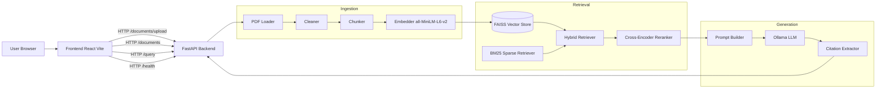

# ResearchMind

ResearchMind is a production-style AI research assistant built to explore retrieval-augmented generation (RAG), information retrieval, embeddings, reranking, grounded generation, and evaluation.

## Project Goals
- Build a complete RAG pipeline
- Compare dense, sparse, and hybrid retrieval
- Experiment with reranking
- Evaluate retrieval and generation quality
- Build a production-style FastAPI backend
- Containerize and deploy the system
- Measure performance and reliability

## Current Status

Core frontend and backend pipeline is wired and runnable locally and with Docker Compose.

## Architecture

## Tech Stack

- FastAPI
- Uvicorn
- React + Vite
- FAISS + BM25
- Sentence Transformers
- Ollama
- pytest

## Evaluation

Results will be added only after running actual experiments.

## Installation

1. Clone the repository.
2. Create and activate a Python environment.
3. Install backend dependencies:
    - `pip install -r backend/requirements.txt`
4. Install frontend dependencies:
    - `cd frontend && npm install`
5. Create `.env` from `.env.example` and adjust values if needed.

## Running Locally

1. Start Ollama and pull the model:
    - `ollama pull llama3.2:3b`
2. Start backend from repo root:
    - `python -m uvicorn app.main:app --reload --app-dir backend`
3. Start frontend:
    - `cd frontend && npm run dev`
4. Open `http://localhost:5173`.

## Docker

Run the complete stack:

- `docker compose up --build`

Services:

- Frontend: `http://localhost:5173`
- Backend: `http://localhost:8000`
- Ollama API: `http://localhost:11434`

## Deployment

Use the provided Dockerfile for backend image builds and `docker-compose.yml` for local multi-service orchestration.

## Limitations

- Requires a local or reachable Ollama instance.
- Retrieval quality depends on chunking and model quality.
- Current setup is single-backend instance without distributed storage.

## Future Work

- Add metrics and observability endpoints.
- Add CI tests for API integration.
- Add production frontend serving with static assets.

## Troubleshooting

- 401 errors: verify token exists and backend secret is consistent.
- No AI response: check Ollama service, model name, or set OLLAMA_ENABLED=false.
- Empty case list: run seed command.
- CORS issues: verify CORS_ORIGINS includes frontend host.

## License

MIT License. See LICENSE.